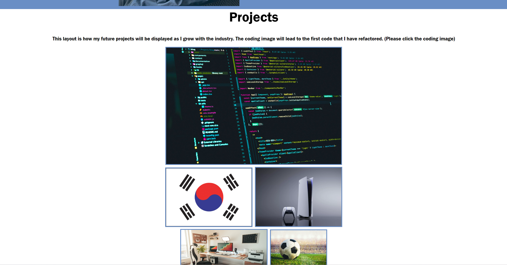

# Portfolio

## Description
My motivation to build this project was to mainly get an idea of what my personal portfolio would look like once I am done with the course. This is a simple visualization of the layout and what I want my portfolio to include, I hope to include more elements and projects that I will be working on in the future for my future employers to see. I learned throughout this portfolio project that many factors come into account when creating a website from scratch and debugging takes a lot of time to accomplish. 

## Installation 
https://github.com/Ericlee1783/Portfolio This link takes us to the repo where my codes are stored.
https://ericlee1783.github.io/Portfolio/ This link will take us to the actual website, hence, my portfolio. 

## Usage
 

These are the screenshots of what the website should look like and down below is the mobile version. 

